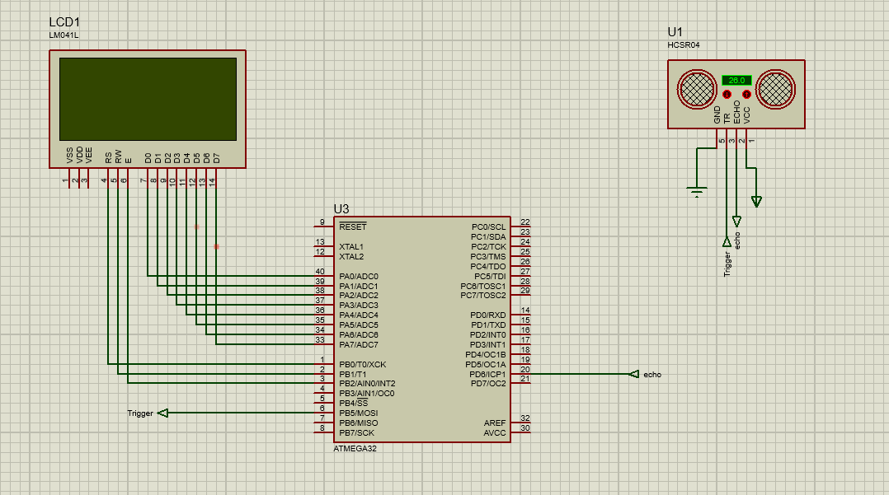
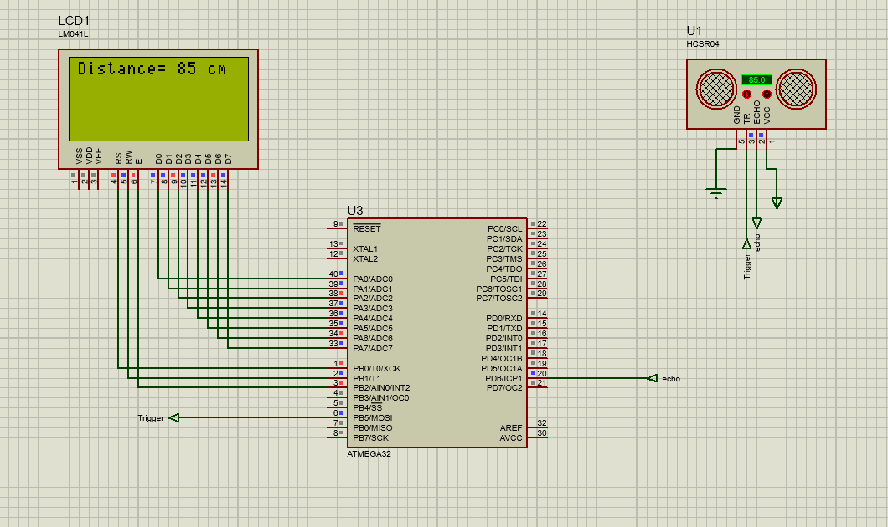

# Temperature Controlled Fan

Embedded System Application Based on C.

## Description

 Embedded System Application in which measuring the distance between ultrasonic and an obstacle.

 ***Features***

1. GPIO  
2. ULTRASONIC
3. ICU
4. LCD
5. Microcontroller: ATMega16

## Getting Started

### Dependencies

* C
* AVR Microcontroller (ATMega32)
* Proteus Software 

### Installing

```
git clone https://github.com/ZiadSheriif/Ultrasonic-Sensor.git 
```
### Executing program

```
open ultrasonic.elf in ulrasonic.pdsprj
```
```
run ultrasonic.pdsprj
```

### Screenshots





<!-- #### Demo Video -->
<!--  -->

### Contributors

<table>
<tr>
<td align="center">
<a href="https://github.com/ZiadSheriif" target="_black">
<br /><sub><b>ZiadSherif</b></sub></a><br />
</td>
</tr>
 </table>

## License <a name="license"></a>

> This software is licensed under MIT License,
> See [License]() for more information ©ZiadSheriif.
